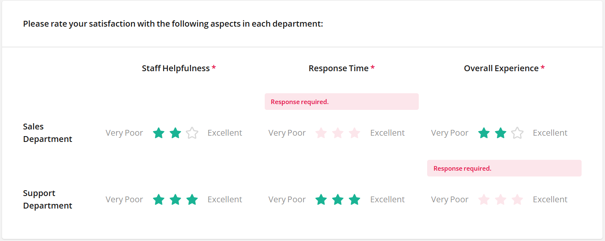

## Entry Title

### Question
...

### Answer
...

#tag1 #tag2 #tag3

---

## How to answer a survey offline

### Question

I want to create a survey, send it to respondents, and give them the option to answer it offline, then save it locally.

### Answer

Use [SurveyJS PDF Generator](https://surveyjs.io/pdf-generator/examples/save-completed-forms-as-pdf-files/reactjs) to export a survey as a fillable PDF.

To export a blank survey, do **not** define `surveyPDF.data` before exporting the survey:

```js
const surveyPDF = new SurveyPDF.SurveyPDF(surveyJson);
// Do not set surveyPDF.data for a blank form
surveyPDF.save();
```
Send the generated PDF to the respondent. They can fill it offline using any PDF reader and email it back to you.

Once you receive the filled PDF:
- You can manually enter the answers into your system
- Or programmatically parse the PDF using tools like: pdf-lib, PDF.js.

#offline #pdf #export #fillable-forms

---
## Set countdown for a question

### Question
How to set a countdown on a certain question? For example, this question needs to be answered in 60 seconds

### Answer

To enable a timer for individual questions, place each question to a separate page and configure the [`PageModel.timeLimit`](https://surveyjs.io/form-library/documentation/api-reference/page-model#timeLimit)  property for an individual page. Once the time expires, a user will be automatically moved to the next page.

[View Demo](https://plnkr.co/edit/6C1XC85RfmhezFWV)
```
{
 "title": "Sample Quiz", 
 "showTimerPanel": "top",
 "showTimerPanelMode": "page",
 "pages": [
  {
   "name": "page1",
   "elements": [
    {
     "type": "html",
     "name": "question1",
     "html": "Now, we are ready to start!"
    }
   ]
  },
  {
   "name": "page2",
   "maxTimeToFinish": "60",
   "elements": [
    {
     "type": "radiogroup",
     "name": "question2",
     "choices": [
      "Item 1",
      "Item 2",
      "Item 3"
     ]
    }
   ]
  },
  {
   "name": "page3",
   "maxTimeToFinish": "0",
   "elements": [
    {
     "type": "radiogroup",
     "name": "question3",
     "choices": [
      "Item 1",
      "Item 2",
      "Item 3"
     ]
    }
   ]
  },
  {
   "name": "page4",
   "maxTimeToFinish": "0",
   "elements": [
    {
     "type": "radiogroup",
     "name": "question4",
     "choices": [
      "Item 1",
      "Item 2",
      "Item 3"
     ]
    }
   ]
  }
 ],
 "firstPageIsStarted": true
}
```
However, in this mode, pages which do no contain time limits, the timer still appears. If you wish to completely remove the timer, conditionally start and stop the timer when a user switches between survey pages. 

[View Demo](https://plnkr.co/edit/4uFJM3PP2CJGbDqK)

In this demo, the time limit is enabled for specific form pages (`page2`, `page3`, `page4`). Other survey pages contain instructions. Implement the [`survey.onCurrentPageChanged`](https://surveyjs.io/form-library/documentation/api-reference/survey-data-model#onCurrentPageChanged) and [`survey.onStarted`](https://surveyjs.io/form-library/documentation/api-reference/survey-data-model#onStarted) functions to stop a timer when the current survey page doesn't contain a time limit and start the timer when a page contains a time limit. To prevent users from moving backward, disable the Previous navigation button using the [`survey.showPrevButton`](https://surveyjs.io/form-library/documentation/api-reference/survey-data-model#showPrevButton) property.
```js
survey.showPrevButton = false;
function stopTimer(surveyModel){
       surveyModel.stopTimer();
};
function startTimer(surveyModel){
        surveyModel.startTimer();
};
survey.onCurrentPageChanged.add((sender, options) => {
         if(sender.currentPage.timeLimit === 0){
            stopTimer(sender);
        } else {
            startTimer(sender);
        }
});
survey.onStarted.add((sender, options) => {
         if(sender.currentPage.timeLimit === 0){
            stopTimer(sender);
        } else {
            startTimer(sender);
        }
});
```

#timer #countdown

---
## Making Matrix Rows Required in SurveyJS

### Question
How to create a multi-select matrix question where each row is required to be answered?

### Answer
To ensure that respondents answer all rows in a Multi-Select Matrix, enable the [`MatrixDropdownColumn.isRequired`](https://surveyjs.io/form-library/documentation/api-reference/multi-select-matrix-column-values#isRequired) option for each matrix column. 

```
{
  "pages": [
    {
      "name": "page1",
      "elements": [
        {
          "type": "matrixdropdown",
          "name": "serviceSatisfaction",
          "title": "Please rate your satisfaction with the following aspects in each department:",
          "columns": [
            {
              "name": "Staff Helpfulness",
              "title": "Staff Helpfulness",
              "cellType": "rating",
              "isRequired": true,
              "rateType": "stars",
              "rateCount": 3,
              "rateMax": 3,
              "minRateDescription": "Very Poor",
              "maxRateDescription": "Excellent"
            },
            {
              "name": "Response Time",
              "title": "Response Time",
              "cellType": "rating",
              "isRequired": true,
              "rateType": "stars",
              "rateCount": 3,
              "rateMax": 3,
              "minRateDescription": "Very Poor",
              "maxRateDescription": "Excellent"
            }
          ],
          "rows": [
            {
              "value": "salesDept",
              "text": "Sales Department"
            },
            {
              "value": "supportDept",
              "text": "Support Department"
            }
          ]
        }
      ]
    }
  ]
}
```
Respondents will require provide a response in every row for each required column.


---
## Implement Search-as-You-Type Dropdown with API Calls

### Question
How to create a dropdown that searches an API as the a types and populates results dynamically?

### Answer
Enable the [Lazy Loading](https://surveyjs.io/form-library/examples/lazy-loading-dropdown/) feature and use the [`SurveyModel.onChoicesLazyLoad`](https://surveyjs.io/form-library/documentation/surveymodel#onChoicesLazyLoad) event to implement search-as-you-type functionality with API calls.

Within the `onChoicesLazyLoad` function, use `options.filter` to detect when the user is typing and call `options.setItems([], 0)` for an empty initial state. When a user specifies a search string, send a request to your API endpoint to fetch choices and use  `options.setItems(data.results, data.total)` to populate the dropdown list. To configure a debounce value (a delay time before the API call is made), use the [`settings.dropdownSearchDelay`](https://surveyjs.io/form-library/documentation/api-reference/settings#dropdownSearchDelay) setting.

```js
// Set debounce delay (in milliseconds)
survey.settings.dropdownSearchDelay = 500;

// Handle lazy loading with API calls
survey.onChoicesLazyLoad.add((_, options) => {  
 if (!options.filter) {
   // Show empty dropdown initially
   options.setItems([], 0);
 } else {
   // Make API call with user's search term
   const url = `https://api.example.com/search?q=${options.filter}&skip=${options.skip}&take=${options.take}`;
   sendRequest(url, (data) => { 
     options.setItems(data.results, data.total); 
   });   
 }
});

#lazy-loading #api-integration #search-dropdown #debounce